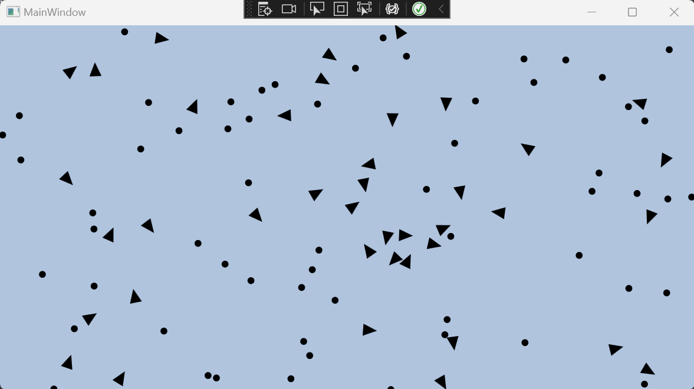

# Terrorarium

## Overview
Terrorarium is a machine learning project I created to learn about neural networks, genetic algorithms, F#, and functional programming. It simulates a series of birds that compete with each other for food, with behavior that improves over generations.

The simulation is setup by
1. Randomly generating a large amount of food, each at a random location.
2. Randomly generating birds, also at random locations, each with a unique feed forward neural network with randomly generated weights
   
At each step in the simulation, three things occur
1. The birds eat whatever food they come in contact with, at which point the food will respawn at a random position.
2. Each bird takes information about what food it can "see", and passes it into its neural network. The result of the network determines what facing and speed the bird will adopt.
3. The birds take a step in the direction and amount determined at step 2

After enough steps, a new generation of birds are generated by
1. Randomly selecting a pair of parents of the previous generation. This is done using random rank selection, with birds that ate more food receiving a comparitively higher rank.
2. Turning the weights in the neural network into "genes"
3. Performing genetic crossover between the genes of the parents, with additional gaussian mutation
4. Turning the genes back into birds and their associated neural network

## Tech Stack
Frontend: C# and WPF

Backend: F#

## Future Improvements
> ~~Performance Improvements~~

~~As my first large F# project, I was not versed in best practices ahead of time. So the first step is to go back and fix unintended performance problems.~~

Complete

> Weight and Simulation Stat Files

After each simulation step, it would be useful to get the weights of all the animals and the stats for that simulation run put in a file for future use or restarting. 

## Special Thanks
Patryk Wychowaniec. Terrorarium started as a F# rewrite of his Shorelark project, which can be found here https://github.com/Patryk27/shorelark, alongside his blog explanation here https://pwy.io/posts/learning-to-fly-pt1/
