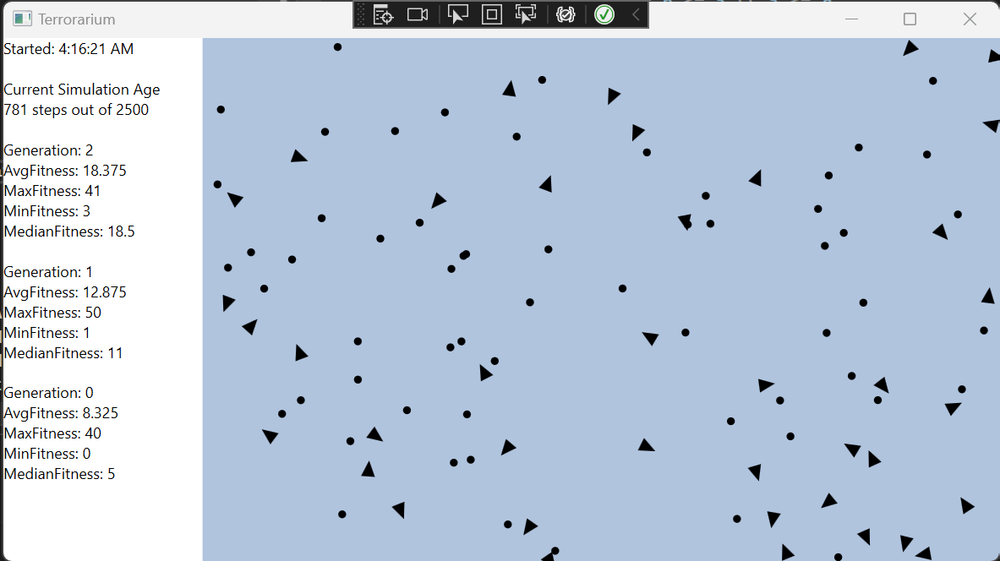

# Terrorarium

## Overview
Terrorarium is a project I'm using to learn about F#, functional programming, machine learning, and genetic algorithms. It consists of animals eating food, and improving how to do so over time.

## Future Improvements
> ~~Performance Improvements~~

~~As my first large F# project, I was not versed in best practices ahead of time. So the first step is to go back and fix unintended performance problems.~~

Complete

> Weight and Simulation Stat Files

After each simulation step, it would be useful to get the weights of all the animals and the stats for that simulation run put in a file for future use or restarting. 

> Adding carnivores alongside herbivores

This requires much more complicated neural networks to work well. The afformentioned performance improvements will need to be done first.

## Special Thanks
Patryk Wychowaniec. Terrorarium started as a F# port of his Shorelark project, which can be found here.
https://github.com/Patryk27/shorelark

https://pwy.io/posts/learning-to-fly-pt1/

Christy Karacas and the Superjail team 
